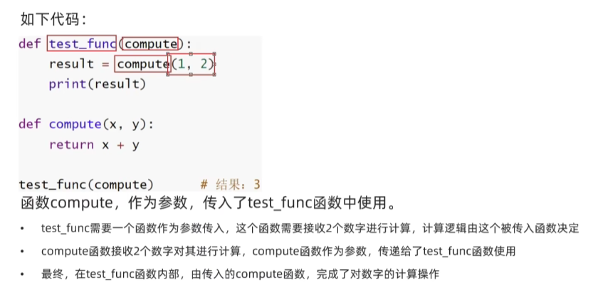

# 函数进阶
函数多返回值
函数多种传参方式
匿名函数

### 多个返回值
如果一个函数要有多个返回值
 def test_return():
    return 1,2
x,y = test_return
print(x)
print(y)

按照返回值的顺序，写对应顺序的多个变量接收即可
变量之间用逗号隔开
支持不同类型的数据return

### 02 函数的多种参数使用形式
位置参数 关键字参数 不定长参数 缺省参数

位置参数：调用函数时根据函数定义的参数位置来传递参数
def usr_info(name,age,gender)
    print(f"您的名字是{name},年龄是{age},性别是{gender}")
usr_info('TOM',20,male)
注意：传递的参数和定义的参数的顺序及个数必须一致

关键字参数： 函数调用时通过“键=值”的形式传递参数
作用：可以让函数更加清晰、容易使用，同时清除了参数的顺序需求
def usr_info(name,age,gender)
    print(f"您的名字是：{name},年龄是：{age},性别是{gender})
usr_info(name="小明“,age=20,gender="男")
可以按照不固定的顺序
usr_info(name="小明“,gender="男",age=20)
可以和位置参数混用，但是位置参数必须在前，且匹配参数顺序
缺省参数

不定长参数：也叫可变参数，用于不确定调用的时候会传递多少个参数的场景
作用场景：当调用函数时不确定参数个数时

位置传递 *args 
传进的所有参数都会被args变量收集，合并为一个元组tuple，位置传递

关键字传递 *kwargs
参数是 键=值 形式，被kwargs接收组成字典

### 函数作为参数传递

def test_func(compute)
    result = compute(1,2)
    print(result)
def compute(x,y)
    return x + y

