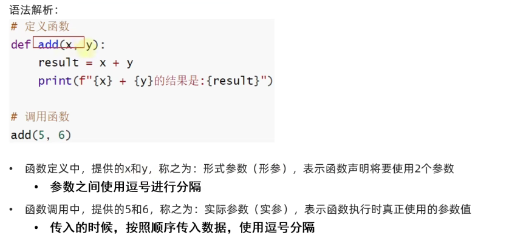
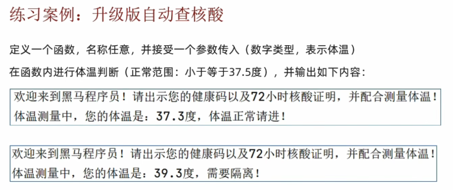
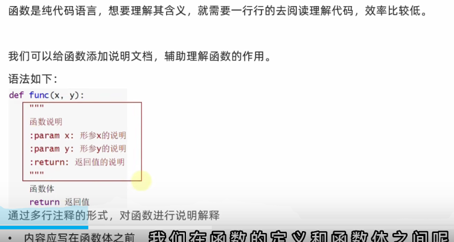
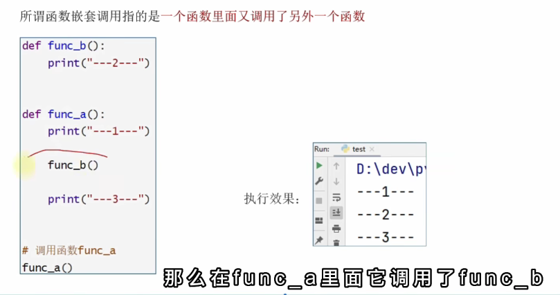

函数：是组织好的，可重复使用的，用来实现特定功能的代码段。
    目的：为了得到一个针对特定需求，可供重复利用的代码段，以提高程序的复用性，减少重复性代码，提高开发效率

# 02 函数的基本定义与语法
## 函数的定义
函数
def 函数名 （传入参数）：
    函数体
    return 返回值
// 省去传入参数和返回值

## 函数的调用
函数名（参数）

# 04 函数的传入参数
功能：在函数进行计算的时候，接受外部（调用时）提供的数据

def add(a,b):
    result = a + b
    print(f"{a}+{b}")

定义中提供的a和b，称作为形式参数（形参），用逗号隔开
调用中使用的5和6，称之为实际参数（实参），用逗号隔开

案例

# 06 函数的返回值
返回值的定义：函数完成事情后，最后给调用者的结果

如果没有使用return语句返回语句，那么函数有返回值吗？
默认是返回了 None这个字面量 返回了空
None是特殊字面量 类型为<calss 'NoneType'>

# 08 函数的说明文档
给函数添加说明文档，辅助理解函数的作用
语法如下

def func(x,y):
    """
函数说明
：param x
"""

# 09 函数的嵌套调用
函数的嵌套调用：在一个函数里面又调用了另外一个函数

