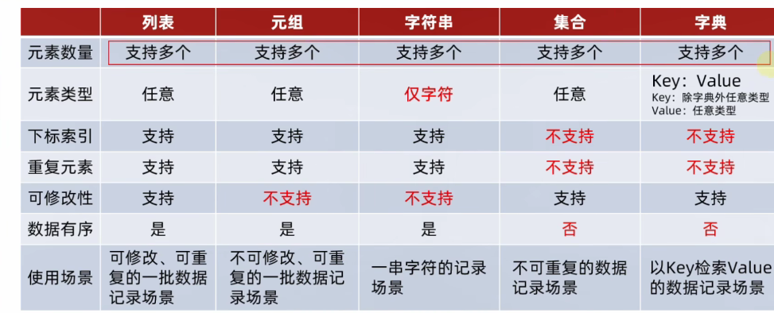

# 数据容器

## 01 数据容器的入门

数据容器定义：一种可以存储多种元素的python数据类型
一种可以容纳多份数据的数据类型，容纳的每一份数据称之为1个元素
每一个元素，可以是任意类型的数据
分类
划分标准：是否支持重复元素、是否可以修改、是否有序
数据容器根据特点的不同，分为5类
列表（list） 元组（tuple) 字符串（str） 集合（set) 字典（dict)

## 02 数据容器：list 列表
基本语法
 字面量
[元素1，元素2，元素3，元素4，...]

定义变量
变量名称 = [元素1，元素2，元素3，元素4]

定义空列表
变量名称 = []
变量名称 = list()

注意事项
列表内的每一个数据，称之为元素
以[]作为标识，列表内每一个元素之间用,逗号隔开
列表一次可以存储多个数据，且可以为不同的数据类型，支持嵌套

## 03 列表的下标索引

列表[下标索引]
也可以反向索引

## 04 列表的常用操作

列表的方法
 定义
 使用下标索引获取值
 插入元素
 删除元素
 清空列表
 修改元素
 统计元素个数

什么叫方法？
在python中，如果把函数定义为class(类)的成员，那么函数就称之为：方法
函数
def add(x,y):
 return x + y

方法
class Student
    def add(self,x,y):
      return x + y
二者的差异
方法和函数功能一样，有传入参数，有返回值，知识方法的使用格式不同：
函数的使用： num = add(1,2)
方法的使用： student = Student()
           num = student.add(1,2)

### 列表的查询功能（方法）
查找某元素的下标
 功能：查找指定元素在列表的下标，如果找不到，报错ValueError
 语法：列表.index(元素)
 index就是列表对象（变量）内置的方法（函数）

修改特定位置(索引)的元素值
语法： 列表[下标] = 值
直接重新赋值修改

插入元素
语法：列表.insert(下标，元素)，在指定的下标位置，插入指定的元素
my_list = [1,2,3]
print(mylist)
my_list.insert(1,"itheima")
print(f"插入后的列表内容为 ：{my_list}")
下标，就是要插入的元素在新的列表的位置

追加元素
语法：列表.append(元素)，将指定元素，追加到列表的尾部
my_list = [1,2,3]
my_list.append(4)
print(my_list) #结果是[1,2,3,4]

追加一个列表
my_list = [1,2,3]
my_list.append([4,5,6])
print(my_list) #结果是[1，2，3，4，5，6]

