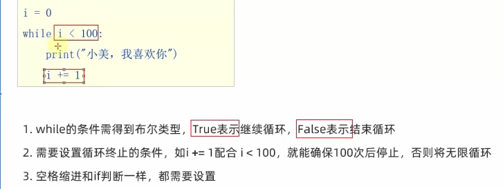
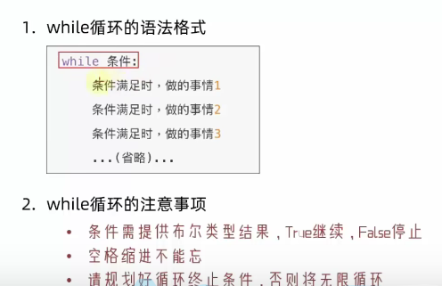
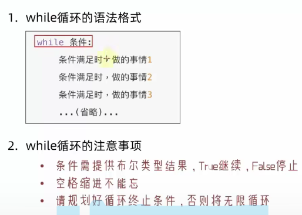
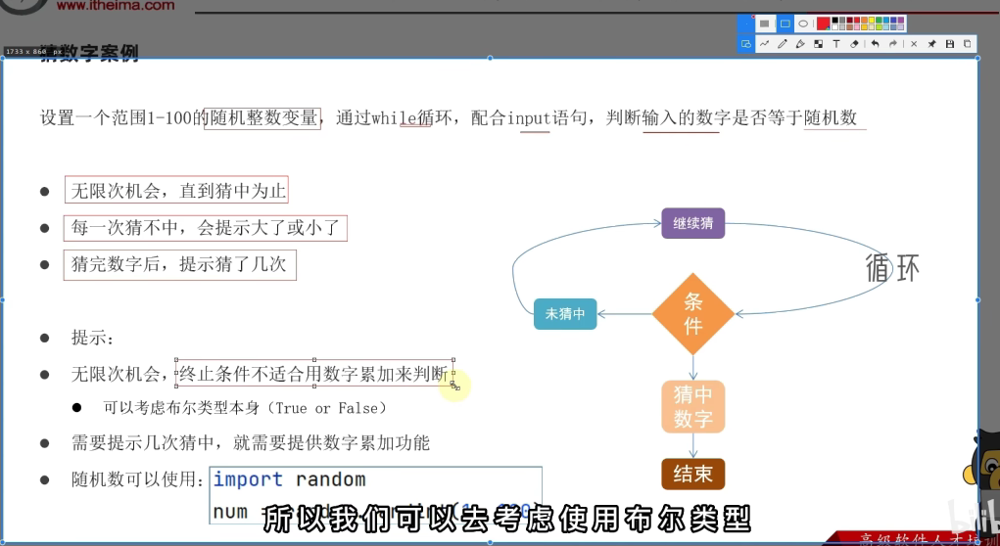
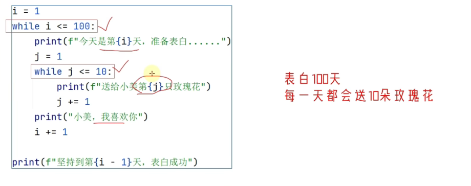
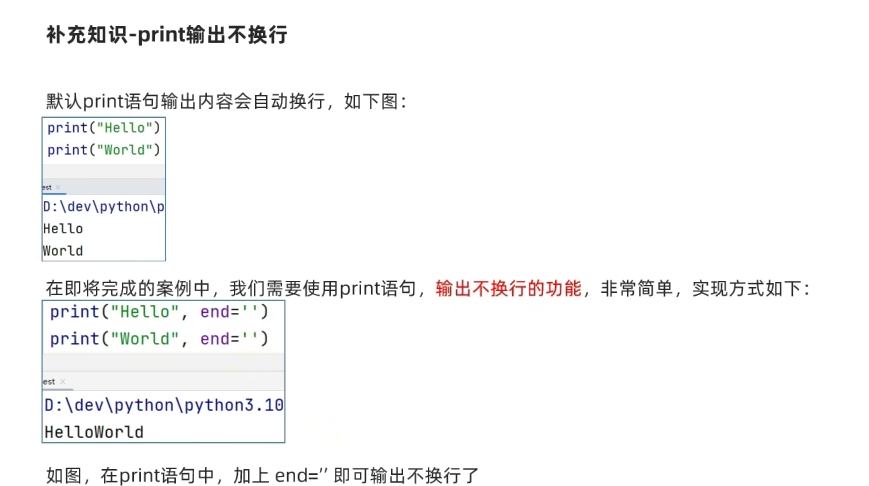
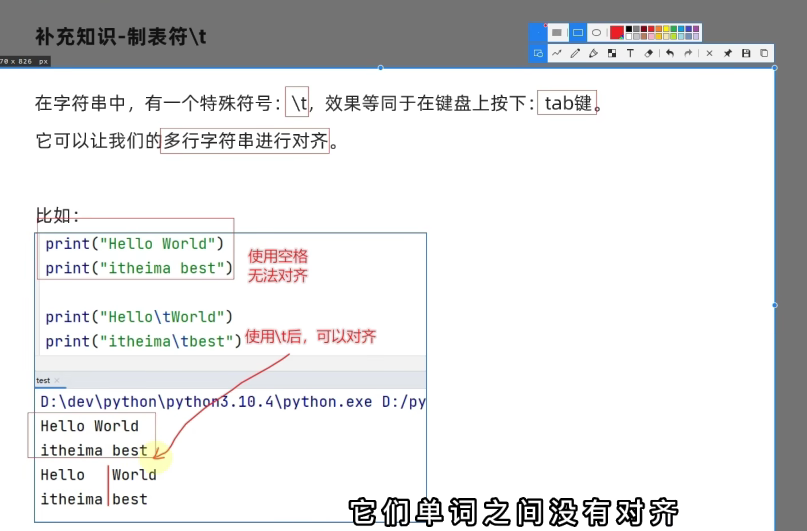
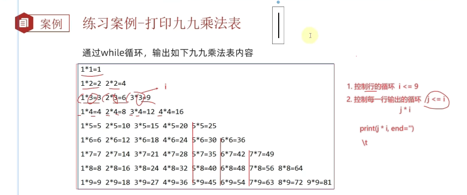
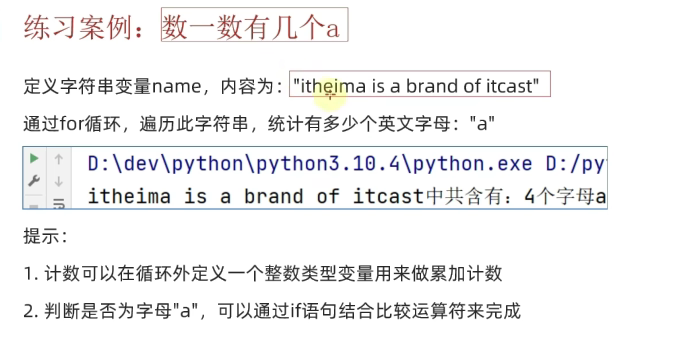
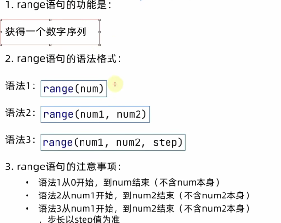

# 循环语句
## While基础应用

程序中的循环
while 条件 ：
    条件满足时，做的事情1
    条件满足时，做的事情2
以此类推
只要条件满足，会无限循环执行

i = 10
while i < 100 :
print("小美。我喜欢你")
i + = 1

while循环的嵌套

不换行 end=''

# print("hello world",end='')
# print("hello world",end='')
#

对齐 制表符\t
字符串在多行中也能对齐

print("Hello\tworld") #记得删除空格
print("iTheima\tbest")

案例 打印九九乘法口诀表

for循环
while循环的循环条件是自定义的，可自行控制循环条件
for循环是一种轮询极致，对一批内容进行的逐个处理（待办事项）

语法
for 临时变量 in 待处理数据集：
    循环满足条件时执行的代码

遍历字符串
# 定义字符串name
name = "itheima"

# for循环处理字符串
for x in name：
    print(x)

将字符串的内容：依次取出
所以for循环也称：遍历循环

for 变量 in 被处理的数据 
# 由于被处理的数据理论上不可能无限的大，因此for理论上无法构建无限循环

range 语句
待处理数据集，严格来说，就是序列类型

for循环语句，本质上时遍历序列类型

通过range语句，获得一个简单的数字序列

语法1
range((num))
获取一个从0开始，到num结束的数字序列，但不包括num本身
如range(5)获得的数据是：{0，1，2，3，4}

语法2
range(num1,num2)
获得一个从num1开始，到num2结束的数字序列，但不含num2本身
如range(6,11)取得的数据是{6，7，8，9，10}但是不包括11

语法3
range(num1,num2,step)
获得一个从num1开始，到num2结束的数字序列，这段数字之间的步长，以step为准
如range{5,10,2}取得的数据是{5，7，9}

