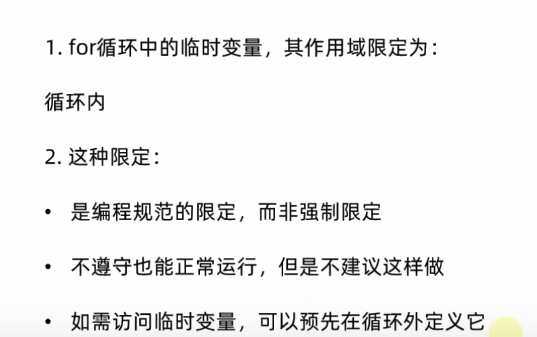
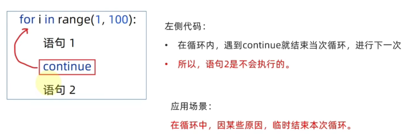

# 循环语句
## While基础应用

程序中的循环
while 条件 ：
    条件满足时，做的事情1
    条件满足时，做的事情2
以此类推
只要条件满足，会无限循环执行

i = 10
while i < 100 :
print("小美。我喜欢你")
i + = 1

while循环的嵌套

不换行 end=''

# print("hello world",end='')
# print("hello world",end='')
#

对齐 制表符\t
字符串在多行中也能对齐

print("Hello\tworld") #记得删除空格
print("iTheima\tbest")

案例 打印九九乘法口诀表
